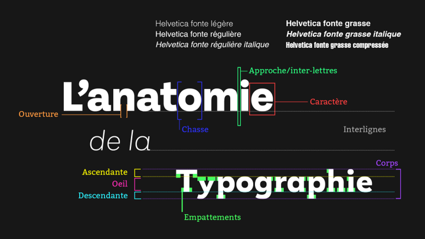
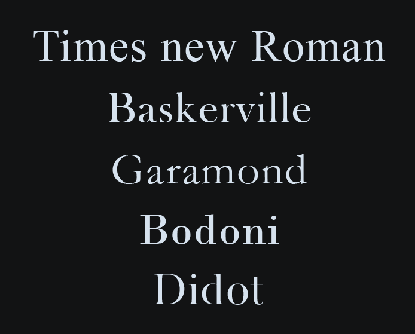
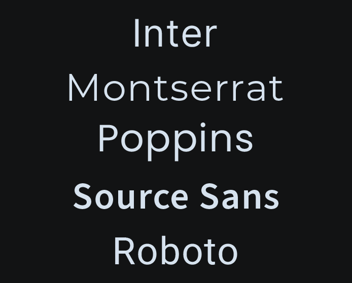
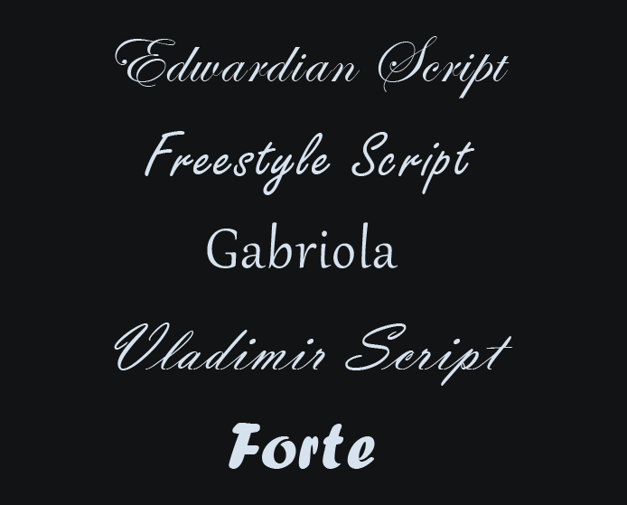
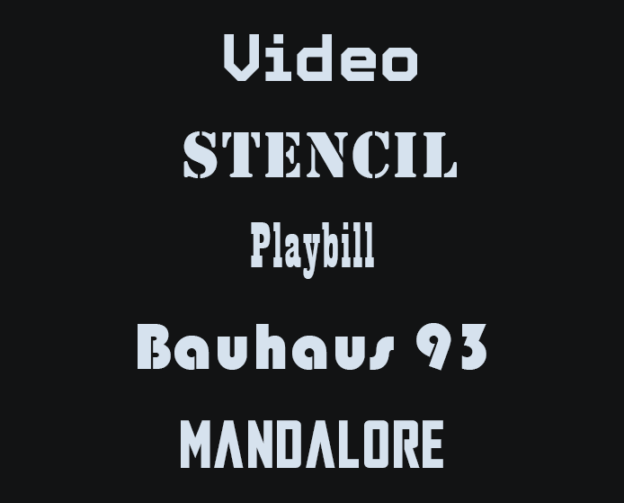
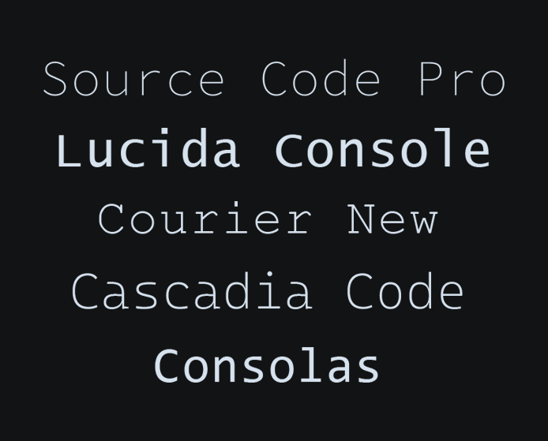
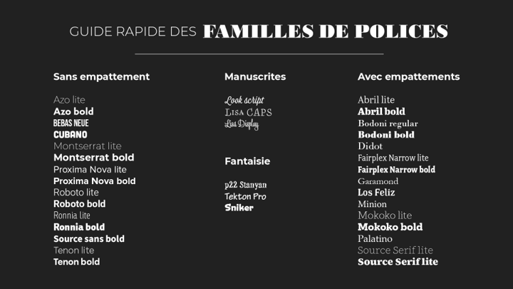

# Cours 10 : Typographies et animations

## Ordre du jour 

- [Notions de typographies](#notions-de-typographies)
- [Ajout de textes et animation dans Canva](#ajout-de-textes-et-animation-dans-canva)
- [Travail sur le TP3](#travail-sur-le-tp3)

## Notions de typographies

### Définition 

La typographie est un des piliers de la conception graphique, c'est un concept qui peut désigner plusieurs sujets, mais on l’utilise généralement pour signifier deux points particuliers : 

- La « science » du processus d’impression traditionnel 
- L’art de valoriser l’aspect esthétique des lettres ou d’optimiser la lecture 

### Caractéristiques essentielles

- Caractère : représente la lettre ou l’objet physique pour le transfert d’encre, l’embossage ou l’estampage. 
- Police (aussi appelée police d’écriture ou famille de caractères) : représente l’ensemble d’un groupe de caractères (exemple : Times New Roman, Arial, Calibri, etc.).
- Fonte : représente les caractères dans une famille qui ont des styles différents (gras, italique, etc.).
- Graisse : épaisseur du caractère
- Corps : taille de la police (déterminé en points dans Photoshop)
- Interligne : hauteur de l’espace entre les lignes du texte
- Approche / inter-lettre: espacement entre les caractères
- Chasse : largeur d’un caractère
- Empattement : trait additionnel aux extrémités d’un caractère
- Œil : taille de la ligne
- Ascendante : Partie supérieure d’un caractère
- Descendante : Partie inférieure d’un caractère
- Ouverture : largeur de l’espace ouvert 

### Famille de polices 

Tel que mentionné précédemment, une famille de police représente l’ensemble d’un groupe de caractères (exemple : Times New Roman, Arial, Calibri, etc.). Néanmoins, celles-cis sont classées en plusieurs catégories dont les principales sont les suivantes : 

- [Serif](#serif) ou polices avec empattement 
- [Sans-serif](#sans-serif) ou polices sans empattement 
- [Cursive](#cursive) ou manuscrite : polices qui imitent l’écriture à la main 
- [Fantaisie](#fantaisie) : polices esthétiques ou stylisées 
- [Monospace](#monospace) : polices aux caractères à largeur fixe 

#### Serif

Les familles avec empattements (avec Serif) sont fondamentalement liées à l’imprimerie, elles ont donc pour principale préoccupation la lisibilité. Elles sont donc idéal pour les grands paragraphes puisque les empattements aident à fournir une sorte de ligne qui facilite la lecture. À cause de leur caractère traditionnel, elles sont également bien adaptée aux documents et projets officiels/sérieux. À travers l'histoire, le contraste entre les traits s'est agrandi et donc pour donner un *look* officiel, mais moderne, on peut utiliser des familles comme Bodoni ou Didot par exemple. 

#### Sans-serif

Les familles sans empattement sont marquées par une volonté de moderniser les familles. En enlevant les empattements, la lecture de longs textes est plus difficile, mais l'impact est plus fort pour pour des textes courts (comme des titres par exemple). Pour donner un côté plus moderne ou moins formel, ces familles sont à prioriser.  

#### Cursive 

Les familles cursives (ou manuscrites) sont marquées par un désir de donner une impression organique ou authentique d'où l'effet d'écriture à main levée. Elles sont souvent utilisées pour des signatures ou des logos, mais sont généralement à éviter pour des textes afin de ne pas nuire à la lisibilité.  

#### Fantaisie

Les familles dites de Fantaisies sont généralement très stylisés et donnent du caractère à un texte. Comme pour les familles cursives, elles sont souvent utilisées pour des signatures ou des logos, mais sont généralement à éviter pour des textes afin de ne pas nuire à la lisibilité.   

#### Monospace

Les familles monospace sont des familles où les caractères ont une largeur unique. Ces familles sont généralement utilisées pour donner un caractère informatique ou un effet de machine à écrire. 

### Choix de typo 

Notre décision de choisir un ou des polices de caractères ne devrait pas être seulement guider par un exercice de jugement. En effet, il est important de prendre en compte deux facteurs : la fonction (est-ce que la police est lisible?) et l’esthétisme (est-ce que la *vibe* correspond au sujet?). Pour déterminer ses facteurs, on peut se poser quelques questions : 

#### Est-ce le contexte est formel ou informel? 

Pour un contexte formel/officiel nous allons prioriser des styles classiques avec des empattements, pour un contexte informel/familier, nous allons prioriser des styles modernes sans empattements.  

#### Est-ce pour définir une identité ou du texte usuel? 

Pour une identité authentique/organique, nous allons prioriser une famille cursive alors que pour une identité originale, nous allons prioriser les familles de fantaisies.  

### Combinaison de typo 

Pour donner un effet de priorité de lecture, il est idéal de combiner habilement nos typos. De manière générale, il est pertinent de prendre les éléments suivants en considération : 

- Utiliser des contrastes puissants entre les titres et paragraphes (avec et sans empattements ou encore gras et mince par exemple). 
- Regarder les tendances.
- Trouver une combinaison à partir d’une police en faisant une recherche (sur Google par exemple).
- Ne pas utiliser plus de 2 typos

### Sources et installation de typo

#### Ressource pour trouver des typo

Il existe une quantité astronomique de ressource sur le web pour trouver des typo. Par contre, elle peuvent varier énormément en termes de qualité et de prix. En ce qui nous concerne, je vous recommande les ressources suivante 

- https://fonts.adobe.com/ (utilisation commerciale permise, mais nécessite d’être membre Creative Cloud)
- https://www.dafont.com/ (tous les types de licences sont disponibles)
- https://fonts.google.com/ (utilisation commerciale permise et toujours gratuit)

#### Procédures d'installation 

Pour les polices venant de fonts.adobe, simplement les activer en vous authentifiant avec votre compte Creative Cloud et vous pourrez les utiliser dans Photoshop, Illustrator, etc. 
Sur Windows ou Mac, il suffit de les télécharger, de les ouvrir, de les installer, puis elles seront accessibles directement dans vos applications locales (Office, Adobe, etc.).
Il n'est pas possible d'ajouter des typos personnalisés dans la version gratuite de Canva :(  

## Ajout de textes et animation dans Canva

Pour ajouter du texte dans un projet Canva, il suffit de choisir l'outil texte dans le menu de gauche, puis de choisir entre un titre, un sous-titre ou un bloc de texte simple. Ensuite, on peut personnaliser la police, la taille, la couleur et l'alignement depuis la barre du haut.  

Pour animer le texte, il suffit de le sélectionner puis de cliquer sur le bouton "Animer" dans la barre du haut. Un menu apparaîtra où on peut déterminer le type d'animation et la durée. Parmi les animations, on retrouve les suivantes : 

- Machine à écrire — le texte apparaît lettre par lettre
- Rebond — chaque caractère rebondit à l'écran
- Pop — le texte surgit dynamiquement
- Fondu — apparition ou disparition en douceur
- Panoramique — le texte se déplace à travers l'écran

N.B. Il n'est pas possible d'ajouter plusieurs animations sur un même texte.  

## Travail sur le TP3

