# Cours 11 : Couleurs et introduction au travail synthèse

## Ordre du jour 

- [Retour sur le TP3](#retour-sur-le-tp3)
- [Théorie sur la couleur](#théorie-sur-la-couleur)
- [Correction de couleurs et ajout de filtre dans Canva](#correction-de-couleurs-et-ajout-de-filtre-dans-canva)
- [Introduction au travail synthèse](#introduction-au-travail-synthèse)

## Retour sur le TP3

### Remise et présentation de vos TP3

Envoyez moi un message Teams si vous désirez que votre travail ne soit pas présenté. 

## Théorie sur la couleur

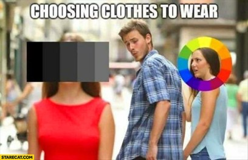

Les couleurs sont un vecteur particulièrement puissant pour transmettre des émotions et font très souvent partie des stratégies de communication en design graphique, mais également en design d’intérieur et en mode. 

### Le cercle chromatique 

Il est difficile de discuter de couleurs sans nommer le cercle qui divise les 12 teintes en un tout continu. On y distingue les éléments suivants : 

- Les couleurs primaires : Rouge, Jaune, Bleu (en imprimerie) ou Rouge, Vert, Bleu (en numérique) sont des couleurs qui ne peuvent pas être obtenues par mélange
- Les couleurs secondaires : Sont les couleurs qu'on obtient en mélangeant deux couleurs primaires
- Les couleurs tertiaires : Sont les couleurs qu'on obtient en mélangeant une couleur primaire et une secondaire adjacente 

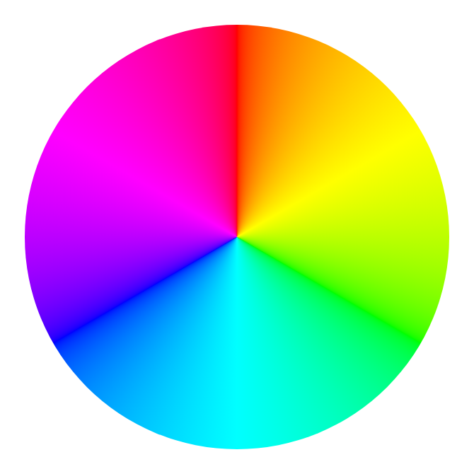

### Propriétés d'une couleur

En traitement numérique, on travaille dans un espace RVB (rouge, vert, bleu). Malgré cela, toutes les couleurs se décomposent selon les paramètres suivants : 

- La teinte : la couleur "pure" (rouge, vert, bleu, jaune, etc.)
- La saturation : l'intensité de la teinte (de gris à la couleur vive)
- La luminosité : la luminance (du noir au blanc en passant par toutes les nuances)

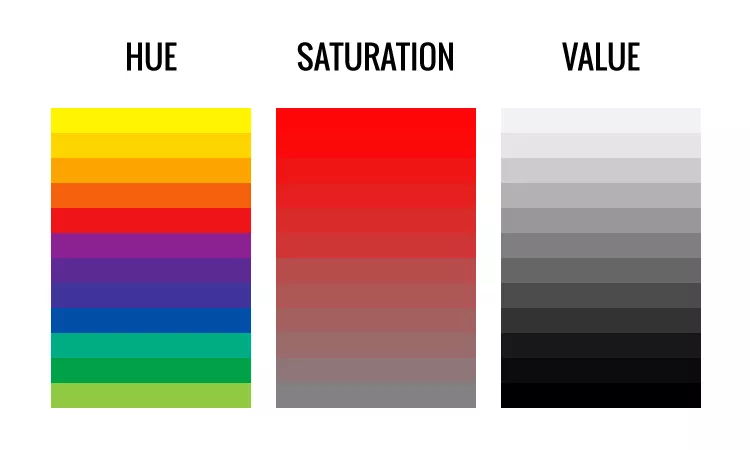

### Notions de palettes de couleurs

Une palette de couleurs est un agencement de 3 à 5 couleurs qui s'harmonisent bien (soit par complémentarité ou par similitude). Pour assembler une palette, il est idéal de commencer par déterminer la couleur dominante en fonction de sa signification et/ou du message que nous voulons véhiculer. Ensuite, on détermine si on reste en chromatisme (variante de la même teinte) ou en complémentarité (couleurs qui se complète ou sont complémentaires) pour trouver nos couleurs secondaires et d'accents. Finalement, on distribue de la manière suivante :

- Pour une palette de 3 couleurs (couleur dominante 60%, couleur complémentaire 30% et accent 10%)
- Pour une palette de 5 couleurs (couleur dominante 60%, couleur complémentaire 25% et 3 accents 15%)

### Les références en couleurs

#### Pantone 

Pantone est une compagnie principalement connue pour son standard de code de couleur : Pantone Matching System (PMS). Ce code permet de garantir un mariage entre l’intention et le résultat. Ce système est utilisé dans la plupart des secteurs d’activité de design. Pour connaître les couleurs tendances, je vous suggère de visiter régulièrement le [site de Pantone](https://www.pantone.com/articles/color-of-the-year?srsltid=AfmBOope0AdxnMorBu5Y1E91B8TAcxQe4oL4c7-uX2CYLX1p4NCU_a2K) ou de faire une recherche sur Google. Vous pouvez par la suite utiliser ses tendances dans vos projets.

#### Adobe

Bien que Pantone soit bien instauré dans le monde du design de mode et d’intérieur, Adobe semble rester la référence de style et de tendances en termes de design numérique. En ce sens, le [site Adobe Color](https://color.adobe.com/create/color-wheel), permet de créer des palettes de couleur en considération de thème, de tendances, ou tout simplement grâce à des outils de conception de palette de couleurs. 

<!-- Cela permet surtout de les sauvegarder dans votre librairie Adobe et de l’utiliser dans vos logiciels préférés en allant dans le panneau librairies. Vous pouvez également faire construire une palette de couleur rapidement à partir de l’application Adobe Capture. -->

### Psychologie de la couleur 

Les couleurs ont également des significations qui leur sont associées. Évidement, ces significations ne sont pas explicites, mais plutôt culturelles et elles évoluent dans le temps.  

Voici un outil de référence complet pour vous aider à saisir la signification des couleurs : [Les couleurs et leur signification](https://www.code-couleur.com/signification/) 

Autrement, voici quelques associations globales : 

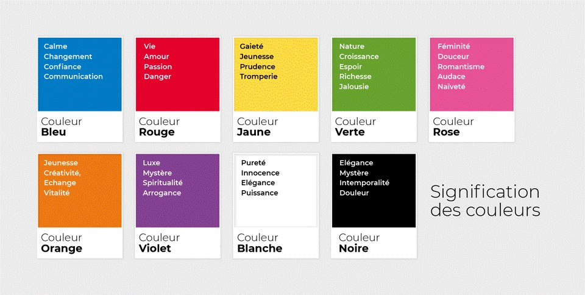

### Choix de couleurs en vidéo 

En montage vidéo, les filtres appliqués sur un plan aident à guider le *mood* d'une scène simplement par le choix d'une couleur. Sans plus loin dans les détails, voici quelques exemples emblématiques couramment utilisés au cinéma et à la télévision. 

# Nuancier — Les six looks cinématographiques

  <!-- Orange & Teal -->
  

    

      
Orange & Teal

      
Action · Cinéma 

    

    

      

#0A1F2E

Noirs

      

#1A3A4A

Ombres

      

#1A9E7D

Teal

      

#5CC4A0

Teal clair

      

#C26030

Orange

      

#E8824A

Hautes lum.

      

#F5C090

Peau

    

  

  <!-- Sépia / Vintage -->
  

    

      
Sépia / Vintage

      
Nostalgie · Mémoire

    

    

      

#1A100A

Noirs

      

#3D2510

Ombres

      

#7A4E28

Bruns

      

#A67040

Médiums

      

#C49A6C

Clairs

      

#DEC090

Lumières

      

#F0E0C0

Blancs

    

  

  <!-- Film noir -->
  

    

      
Film noir

      
Mystère · Fatalisme

    

    

      

#080808

Noirs

      

#181818

Très foncé

      

#383838

Ombres

      

#606060

Médiums

      

#909090

Gris

      

#C0C0C0

Clairs

      

#F0F0F0

Blancs

    

  

  <!-- Horreur froide -->
  

    

      
Horreur froide

      
Malaise · Surnaturel

    

    

      

#040C14

Noirs

      

#0A1520

Ombres

      

#0E2535

Bleu nuit

      

#1A4A30

Vert foncé

      

#2E6848

Vert

      

#608070

Vert pâle

      

#A0C0B0

Lumières

    

  

  <!-- Golden hour -->
  

    

      
Golden hour

      
Romantisme · Espoir

    

    

      

#1A0E06

Noirs

      

#3A1E0A

Ombres

      

#8A4010

Ambré foncé

      

#D06020

Orange

      

#F08830

Or chaud

      

#F5C060

Or

      

#FFF5D0

Blancs

    

  

  <!-- Cyberpunk -->
  

    

      
Cyberpunk

      
Dystopie · Futurisme

    

    

      

#040008

Noirs

      

#0A0018

Fond violet

      

#200040

Violet foncé

      

#800080

Violet néon

      

#FF00AA

Rose néon

      

#00CCAA

Cyan

      

#AAFFEE

Cyan clair

    

  

#### Orange & Teal

Le *look* orange & teal est un des plus dominant au cinéma. En utilisant le contraste entre la teinte de la peau et la complémentarité de l'environnement, les sujets humain ressortent instantanément du décor.

- Émotion : Tension, action, épique
- Harmonie : Complémentaire

#### Sépia / Vintage

Le *look* Sépia / Vintage imite le rendu de la pellicule traditionnelle. La teinte chaude désaturée évoque le passé, le rêve ou la mémoire. 

- Émotion : Nostalgie, mémoire, authenticité
- Harmonie : Monochromatique brun-jaune

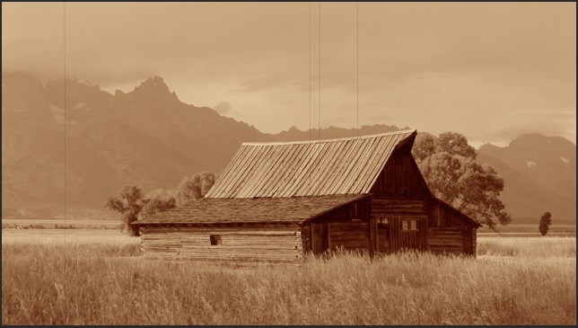

#### Film noir

Le *look* Film noir supprime totalement la couleur. Selon le contraste utilisé, l'ombre peut devenir un espace menaçant (avec un contraste fort) ou la lumière peut devenir apaisante (pour un contraste faible). Cet effet peut parfois être amplifié en laissant une seule teinte visible (comme dans *Sin City* par exemple) ou en appliquant le *look* noir sur un seul élément (comme dans *Spider-man into the spider-verse*).  

- Émotion : Nostalgie, mémoire, authenticité
- Harmonie : Monochromatique brun-jaune

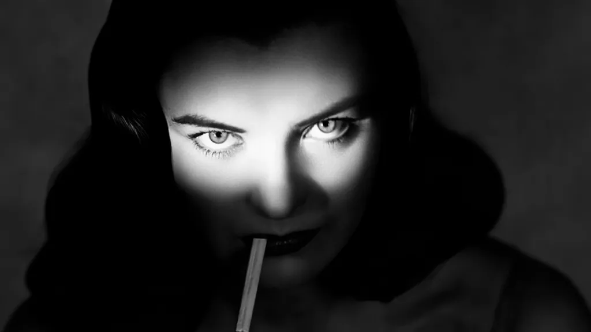
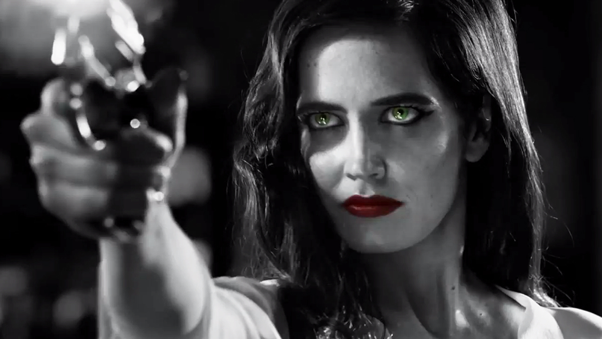
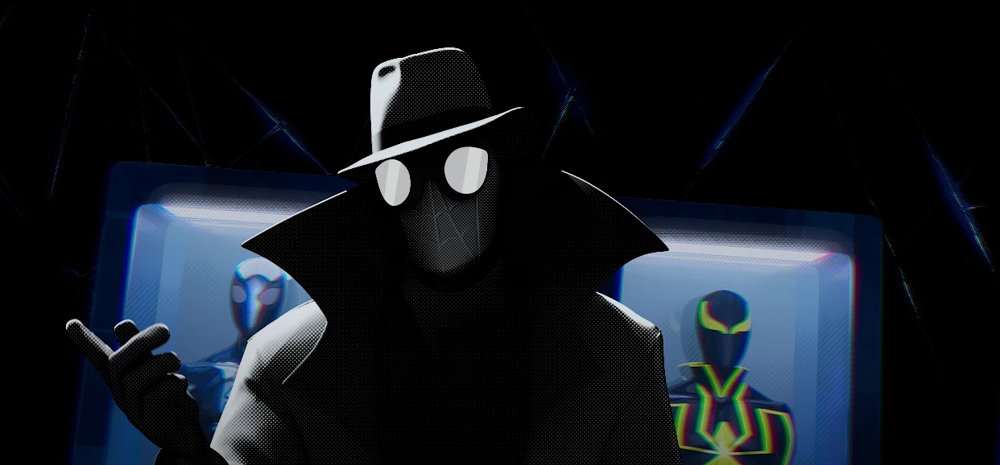

#### Horreur froide 

Le *look* horreur froide est typique pour les atmosphères sombres, hostiles ou d'épouvantes. Le mélange du bleu de la nuit avec le vert désaturé donne une teinte qui rappelle un état malade et fait disparaître la chaleur pour rendre les sujets vulnérables.  

- Émotion : Mystère, menace, fatalisme, tragédie
- Harmonie : Teintes analogues (bleu et vert)

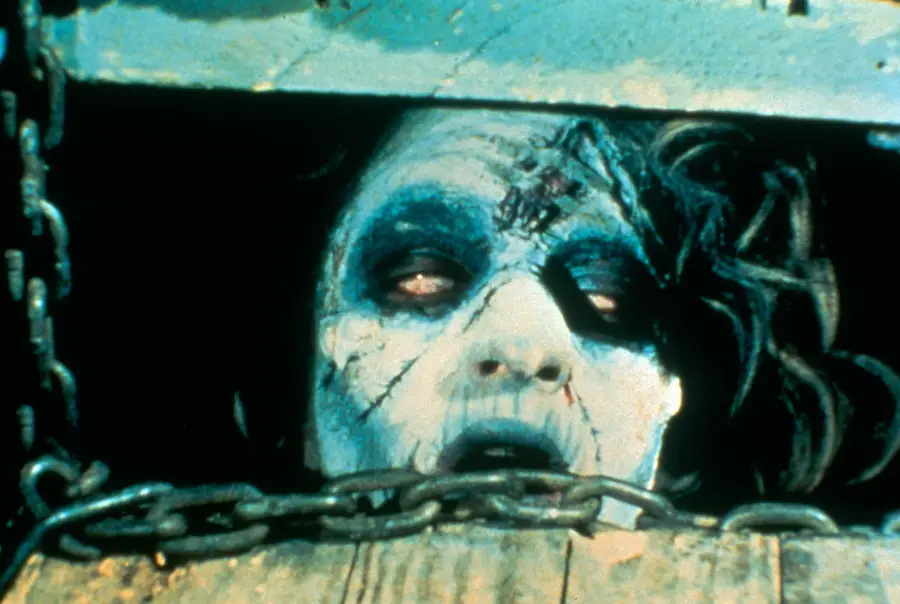
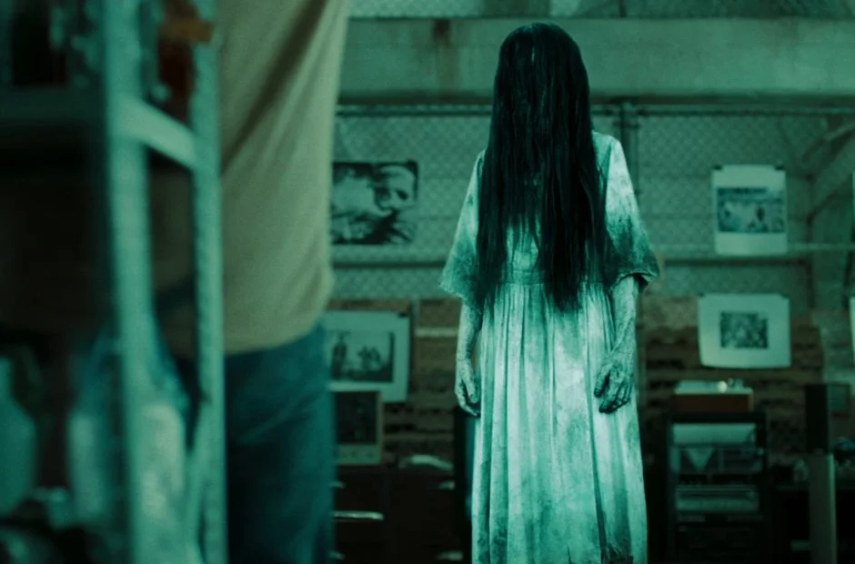

#### Golden Hour

Le *look* Golden Hour avec ses teintes de doré qui rappelle la lumière du couché/levé du soleil autant dans les tons clairs qu'obscurs apporte une atmosphère serene et de beauté.  

- Émotion : Romantisme, espoir, plénitude, beauté 
- Harmonie : Teintes analogues (orange-or-jaune)

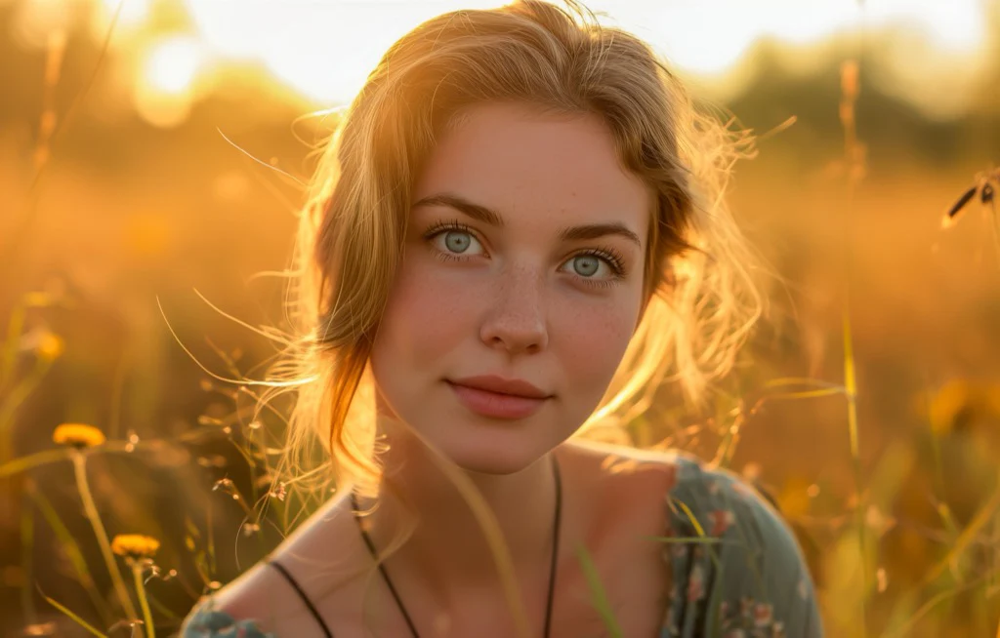

#### Cyberpunk néon

Le *look* Cyberpunk néon est emblématique des univers de ce nom. Les couleurs saturés qui rappelle l'éclairage au néon évoquent les publicités omniprésentes, les technologies permanentes et les villes nocturnes.   

- Émotion : Futurisme, dystopie, excès, aliénation urbaine
- Harmonie : Triadique saturé (violet-rose-cyan)

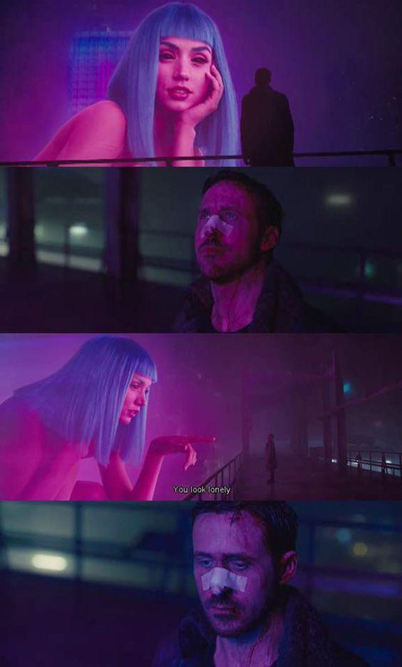

## Correction de couleurs et ajout de filtre dans Canva

### Correction de couleurs

Pour corriger les couleurs dans Canva, il suffit de cliquer sur le plan souhaité, puis sur Modifier dans la barre du haut et finalement sur modifier. De là, on peut modifier les paramètres suivants : 

- Température de la couleur (chaud/froid)
- Nuances (vert/rose)
- Luminosité (lumière globale)
- Contraste (différence entre les tons clairs et foncés)
- Tons clairs (accentuer ou diminuer les tons clairs)
- Ombres (accentuer ou diminuer les tons foncés)
- Blancs (paramètre très agressif pour ajouter du blanc absolu - à éviter)
- Noirs (paramètre très agressif pour ajouter du noir absolu - à éviter)
- Vibrance (saturer uniquement les pixels non-saturé - à priorisé)
- Saturation (saturer tout les pixels - à utiliser avec modération)  

Il suffit finalement d'appliquer le même type de traitement sur tous nos plans. Bien que l'utilisation de la correction de couleurs permet généralement de meilleurs résultats, il n'en reste pas moins un processus intensif et qui demande une grande perception et maîtrise. Pour simplifier le travail, il est possible de simplement "teinter" nos plans avec un filtre. 

### Ajout de filtre 

Pour ajouter un filtre dans Canva, il suffit de cliquer sur le plan souhaité, puis sur Modifier dans la barre du haut et finalement sur Afficher tout dans la section filtre. De là, on peut choisir un filtre spécifique et appliquer le même sur tous nos plans. Je vous invite à d'abord réfléchir à une intention ou un effet, puis de trouver un filtre approprié.  

### Exercice : ajout de filtre sur votre TP3

## Introduction au travail synthèse

Devis du travail synthèse 

