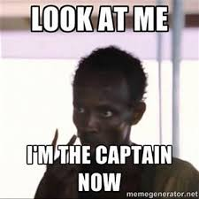
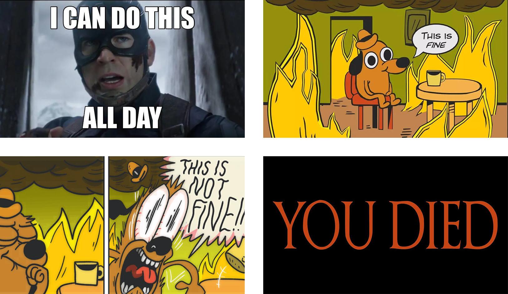
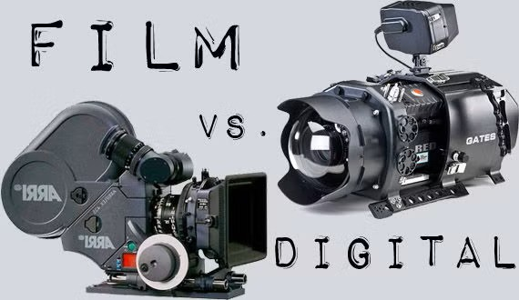
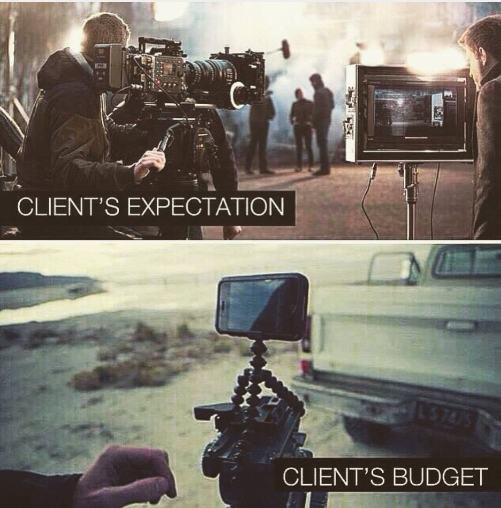
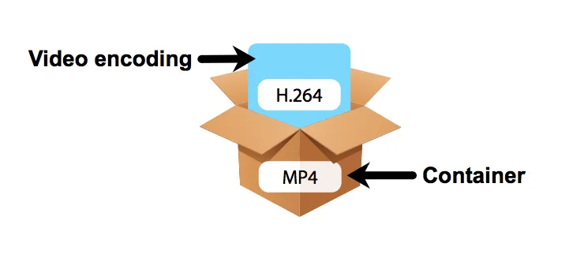
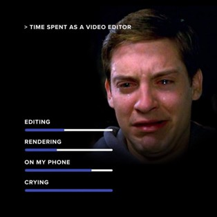

<!-- <link rel="stylesheet" href="./style.css"> -->

## Cours 8 : Introduction à la vidéo 

    

## Ordre du jour 

- [Retour sur la session](#retour-sur-la-session)
- [Présentation des évaluations à venir](#présentation-des-évaluations-à-venir)
- [Introduction à la vidéo](#introduction-à-la-vidéo)
- Introduction à Canvas
- Présentation du TP3

## Retour sur la session

### Sondage sur le niveau de stress

    

    

### Sondage sur le cours

- Quelles sont vos impressions sur le cours (qu'est-ce que vous avez aimé/moins aimé?)
- Qu'avez vous retenu jusqu'à maintenant?
- Qu'est-ce que vous aimeriez faire de plus (ou moins)?

## Présentation des évaluations à venir

### TP3 - Montage vidéo simple (20%)

L'objectif du TP3 sera de faire un montage vidéo simple en utilisant Canvas. La vidéo devra durer environ 30 secondes à 1 minute, contenir des images et du son trouvés en ligne ainsi que du texte puis être remis au format mp4. Le sujet sera : Votre plus grand rêve.   

### Travail synthèse (35%)

L'objectif du travail final sera de créer un montage vidéo d'environ 30 secondes à 1 minute incluant des images (éditées par vous), une trame sonore (musique, dialogue et bruitage) et du texte au besoin. Le sujet sera libre (mais approprié à un cadre scolaire) et l'objectif sera de raconter une petite histoire. 

### Choix des outils pour les TP

Vidéo : Canvas (sera montré en classe) ou autre sous approbation de l'enseignant
Images : Canvas, Gimp ou autre sous approbation de l'enseignant
Audio : Canvas, Audacity (sera montré en classe), MCP Beats ou autre sous approbation de l'enseignant 

## Introduction à la vidéo

Bien qu'il y aurait de nombreuses notions à présenter dans un cours de cinéma (écriture du scénario, pré-production, techniques de caméra/mise-en-scène, éclairage, etc.), nous allons principalement nous intéresser aux caractéristiques essentielles de la vidéo et aux notions/techniques liées au montage grâce à une outil gratuit en ligne : Canvas. Nous allons donc investiguer les sujets suivants :

- [Différence entre cinéma et vidéo](#différence-entre-cinéma-et-vidéo)
- [Caractéristiques essentielles de la vidéo](#caractéristiques-essentielles-de-la-vidéo)
- [Définition du montage vidéo](#définition-du-montage-vidéo)
- [Introduction à Canvas](#introduction-à-canvas) 

### Différence entre cinéma et vidéo

La première différence est essentiellement technologique :
- Le cinéma a toujours reposé et repose encore (généralement) aujourd’hui sur la pellicule (papier photosensible).
- Pour ajouter des effets numériques, les photogrammes sont numérisés un-par-un.
- La vidéo repose sur la traduction d’un signal électrique en information numérique (bande magnétique et disque dur).
- La vidéo est donc traitée directement à l’ordinateur.  
- Bien que la pellicule offre une qualité supérieure, on retrouve de plus en plus de caméra numérique dite "cinéma". Pour bien comprendre la différence entre les niveaux de qualité d'une caméra numérique, je vous invite à écouter la vidéo suivante de [Corridor Crew](https://www.youtube.com/watch?v=dQf9pog-8q0).

Le cinéma se distingue également par son approche et son budget : 
- Le cinéma produit généralement des plus grosses productions
- Le cinéma recherche généralement une démarche expressive ou artistique plus forte
- La ligne entre les deux est de plus en plus mince dans la mesure les productions vidéo sont de plus en plus grosses (avec Amazon et Netflix par exemple) et le cinéma indépendant trouve toujours une niche existante.  

### Caractéristiques essentielles de la vidéo

Quelle provienne d’une source analogique ou numérique, l’image en mouvement se distingue par de nombreux paramètres. Nous nous intéresserons principalement à l’image provenant d’une source numérique dont les paramètres dominants sont les suivants (mais ne se limitent à ceux-ci) :

- [La résolution](#la-résolution)
- [La fréquence d’image](#la-fréquence-dimage) 
- [Encodage et format](#encodage-et-format)

#### La résolution

Les vidéos numériques sont composées d’images matricielles séquencées. De ce fait, chacune d’entre elles comportent les mêmes caractéristiques comme la résolution et la profondeur des couleurs par exemple. Contrairement à l’image fixe, les résolutions des vidéos ont été standardisées afin d’accommoder les écrans. Le plus utilisées et connues sont les suivantes :

- 480p – standard définition (SD)
- 720p et 1080p – haute définition (HD et 1080 parfois appelée Full HD)
- 4k et 8k – ultra haute définition (UHD)

En ce qui nous concerne, nous allons essayer de nous tenir à la résolution 1080p

#### La fréquence d’image

Tel que mentionné précédemment, les images doivent être séquencées à une certaine cadence pour donner l’illusion du mouvement. Nous appelons cette cadence la fréquence d’image (framerate) et elle se calcule par un nombre d’image par seconde (frame per second ou fps). Évidement, plus il y a d’image par seconde et plus l’animation est fluide (et plus on peut faire de ralenti) [comme dans cet exemple](https://www.youtube.com/watch?v=_SzGQkI-IwM), mais plus le fichier de travail sera lourd. Les fréquences les plus connues et utilisées sont les suivantes :

- 24 fps : cadence utilisées pour le cinéma sur pellicule
- 25 fps et 50 fps : cadence utilisées par la télévision Européenne
- 30 fps et 60 fps : cadence utilisées par la télévision Américaine et Japonaise
- 120 fps et plus : cadence utilisées par les plateforme de diffusion en ligne (Youtube par exemple)

Au-delà de 60 fps, les fréquences d’images élevées sont généralement générées par des caméras grande vitesse. Le précédent record permettant de voir la lumière se déplacée était à [10 trillion d’image seconde](https://www.youtube.com/watch?v=7Ys_yKGNFRQ&t=652s). Le record actuel est situé à environ 70 trillion d’images seconde et permet d’observer la fusion nucléaire.  

#### Encodage et format 

Le format concerne la méthode de stockage numérique d’une vidéo qui consiste en une combinaison d’un contenant et d’un encodage.  

Le contenant concerne la structure numérique qui contient les éléments de la vidéo (images et sons). Les contenants les plus connus et encore utilisés sont les suivants :

- WebM – contenant optimisé pour le web (manque de compatibilité avec plusieurs appareils mobiles)
- MKV – contenant open-source 
- MOV – contenant conçu par Apple 
- MP4 – contenant MPEG largement utilisé (celui que nous allons utiliser)

L’encodage concerne l’algorithme de compression (sans compression, les fichiers vidéos seraient beaucoup trop volumineux). Ce processus est plus ou moins destructif selon l’algorithme choisi. Les encodages les plus connus et encore utilisés sont les suivants :

- H.264 – Encodage HD (moyen)
- ProRes – Encodage haute qualité (très lourd)
- VP8/VP9 – Encodage optimisé web (léger)

### Définition du montage vidéo

Le montage vidéo est une pratique qui consiste à assembler des plans tournés dans un ordre logique et cohérent à une démarche artistique. En d'autres termes, le montage permet [d'organiser (ou déorganiser) un récit](https://www.youtube.com/watch?v=5Jcm4Ukep7o). Néanmoins, le montage permet aussi d"amener du sens même là où il n'y en a pas : c'est un effet qu'on appelle [l'effet Koulechov](https://www.youtube.com/watch?v=1qWlIYKeqPc 
). Autrefois exécuté sur les tables de montage, le montage s’exécute aujourd’hui généralement à l’aide d’un logiciel d’édition numérique. En ce qui nous concerne, nous allons utiliser le logiciel en ligne gratuit Canvas. 

Au prochain cours, nous allons nous intéresser aux types de montage, aux coupes et aux raccords, mais pour l'instant, il est simplement important de comprendre que les piste vidéos se chevauchent et que les pistes audio s’additionnent. 

### Introduction à Canvas

Canvas est un défini comme étant un système d'exploitation créatif : c'est une plateforme en ligne qui réuni des outils de création multimédia comme le photomontage, la vidéo et le marketing, mais bien plus. Pour commencer et faire un tour d'horizon, nous allons commencer par se rendre sur le [site](https://www.canva.com/) et se créer un compte. Nous allons travailler avec Canvas gratuit, la suite va vous proposer de manière assez sporadique de payer pour la version Pro : je vous invite à NE JAMAIS ACCEPTER. Bien que de nombreuses fonctionnalités Pro sont pertinentes, elles ne sont pas nécessaire dans le cadre du cours : ces fonctionnalités sont marquées par une petite couronne.

N.B. En tout temps, vous pouvez utiliser le raccourci CTRL-Z pour faire un retour en arrière et annuler les dernières procédures. 

#### Page d'accueil 

La page d'accueil permet simplement de naviguer à travers les différentes fonctions. On peut simplement choisir un nouveau projet prédéfini à partir de la liste offerte ou en cliquant sur le bouton Créer. Autrement, tous nos projets résides dans l'onglet Projets. 

#### Projet vidéo 

Une fois un projet vidéo choisi, les principaux éléments sont les suivants : 

##### Les éléments 

L'onglet Éléments du menu permet de visualiser les éléments disponibles sur Canvas (comme des images, des vidéos et de la musique) ou de téléverser à partir de votre ordinateur (nous verons des ressources pour des éléments libres de droits la semaine prochaine).  

##### La timeline 

La ligne du temps ou timeline, permet simplement de visualiser le projet de manière continu. On peut circuler librement sur la timeline en faisant un cliquer/glisser (click and drag) juste au dessus de celle-ci. On peut également démarrer/mettre sur pause la lecture en appuyant sur la touche espace. Pour ajouter des images, de la vidéo ou du son, on peut simplement faire un cliquer/glisser (click and drag) à partir du menu Éléments à gauche puis vers la timeline. Pour éditer la durée d'un élément, on peut simplement survoler la fin de l'élément et une petite ligne aparaîtra, puis on fait un cliquer/glisser (click and drag) pour la durée désirée.   

##### L'éditeur de plans

Lorsqu'on clique sur un élément de la timeline, on retrouve l'éditeur de plans qui nous permet de modifier l'élément lui-même en termes de durée, coupe, vitesse, couleurs, transparence et position. 

##### Transitions

Pour ajouter une transition entre deux éléments, il suffit de survoler l'espace entre les deux puis de choisir Ajouter transition. Un menu apparaît alors où ou peut déterminer le style et ensuite la durée de la transition. On peut également éditer la transition en cliquant sur le petit bouton apparu entre les deux éléments : changer transition.

##### Menu pour télécharger

Une fois notre vidéo terminée, on peut simplement aller dans le menu fichier puis choisir télécharger.

#### Conclusion

Bien que ces outils soient assez simples, il sont suffisant pour faire des projets dans le cadre du cours. Nous allons tout de même tenter de pousser un peu plus loin les fonctionnalités au prochain cours. Si vous souhaitez voir les éléments de l'introduction dans un cadre visuel, je vous propose d'écouter [la capsule suivante](https://www.youtube.com/watch?v=Z40x5sf4yqQ). Pour l'instant, il sera idéal de pratiquer le tout avec un petit exercice. 

### Exerice dans Canvas 

- À partir de la page d'acceuil, choisir un Créer
- À partir de la liste, choisir Vidéo
- À partir de modèle, choisir Paysage 1920 x 1080
- À partir du menu Éléments, choisir un ordre logique de 5 vidéo (par exemple, partir d'une ville vu de loin et se rendre à l'intérieur d'une maison)
- Ajouter au moins une transition
- À partir du menu élément, ajouter une musique
- Télécharger la vidéo

### Présentation du TP3

[Lien vers le devis](./tp3.md)

