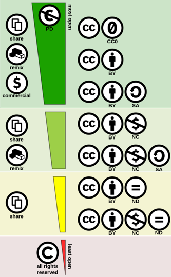

<!-- <link rel="stylesheet" href="./style.css"> -->

# Cours 9 : Notions vidéos avancées

## Ordre du jour 

- [Droits d'auteurs](#droits-dauteurs)
- [Ressources pour médias libres de droits](#ressources-pour-médias-libres-de-droits)
- [Les unités de mesure en vidéo](#les-unités-de-mesure-en-vidéo)
- [Types de montage](#types-de-montage)
- [Coupes](#coupes)
- [Raccords](#raccords)
- [Intégration d'images et de sons dans Canva](#intégration-dimages-et-de-sons-dans-Canva)
- [Exercice de montage](#exercice-de-montage)
- [Travail en classe](#travail-en-classe)

## Droits d'auteurs

### Questions générales 

#### Je prends une photo d'un objet avec mon téléphone et je la publie sur mon blogue personnel. La photo devient virale et quelqu'un d'autre la publie en son nom, est-ce légal?
#### Je prends une photo d'un objet avec mon téléphone et je la publie sur mes réseaux sociaux. La photo devient virale et quelqu'un d'autre la publie en son nom, est-ce légal?
#### Je prends une photo de quelqu'un dans la rue avec mon téléphone et on voit son visage et je la publie sur mon blogue personnel. Est-ce légal?
#### Je prends une photo d'une personalité publique (ex: le premier ministre) dans la rue avec mon téléphone et on le reconnaît. Je la publie sur mon blogue personnel, est-ce légal?

### Définition de droits d'auteurs

Dans la mesure où possédez les droits d’utilisations de vos ressources toutes les œuvres que vous produisez vous appartiennent et nécessitent votre autorisation pour être modifiées ou publiées. 
Cela dit, bien que vos droits soient implicites à votre création, il est toujours plus facile de le prouver si la création est marquée au nom de son propriétaire et que les droits y sont attachés.
DANS TOUS LES CAS, vous devriez toujours vous assurer que vous possédez et/ou que vous avez attribué les droits respectifs ainsi que l'autorisation des personnes impliquées avant de publier du contenu. En ce qui vous concerne, si vous souhaitez publier le contenu que vous avez créé, il est fortement recommandé de spécifier le type de licence attribué à votre travail et de vous assurer d'avoir le consentement écrits des personnes impliquées.

### Domaine publique 

Domaine public : Une œuvre dont l’auteur(e) à renoncer à ses droits ou dont l’auteur(e) est décédé(e) depuis au moins 50 ans (au Canada) fait partie du domaine public. C’est-à-dire qu’il s’agit d’œuvres culturelles qui peuvent être utilisées et modifiées librement avec ou sans buts lucratifs tant qu’il s’agit des œuvres originales. 
Effectivement, une image du domaine public perd ses conditions lorsqu’elle est utilisée par un autre auteur dans une nouvelle œuvre. Il faut donc faire attention à toujours retrouver l’œuvre originale lorsqu’il s’agit du domaine public.  

### Le copyright

Copyright ou tous droits réservés : Une œuvre dont la licence mentionne Copyright ou Tous droits réservés signifie que les droits d’utilisation et de publication sont réservés uniquement à la personne physique ou morale propriétaire de l’objet culturel. 
De ce fait, des frais dits de royautés doivent être versés à l’auteur pour l’utilisation de son objet culturel (par exemple, payer les droits pour utiliser une chanson connue dans un film). Évidemment de nombreuses conditions s’appliquent selon le contexte d’utilisation. 

### Creative commons

Les licences Creative Commons possèdent une série de critères pour être standardisées en quelques catégories qui rendent leur utilisation explicite et conviviale. L’objectif de ses licences inventées aux États-Unis est de protéger les auteurs tout en permettant d’optimiser l’utilisation et le partage de contenu. Lorsque vous cherchez parmi du contenu Creative Commons, il est nécessaire d’être vigilant pour repérer les critères pour utiliser, modifier ou partager le contenu. Les types de licences Creative Commons sont classés selon les critères donnés par l’auteur. Chacun des critères représente une condition à remplir afin d’utiliser ou de partager une œuvre.  

- Attribution (BY)   : Nécessité de mentionner le nom de l’auteur ainsi que la source du matériel (généralement un site web).
- Non-commercial (NC)   : Défense de faire de l’argent ou toute autre forme de profit commercial en lien avec l’œuvre.   
- No derivative works (ND)   : Défense de modifier, de recycler ou d’utiliser dans une autre œuvre. 
- Share-alike   : Nécessité de partager la nouvelle œuvre avec les mêmes critères que l’œuvre d’origine.  

Par la suite, les critères peuvent être combinés pour atteindre des buts précis tels qu’illustrés dans le tableau suivant. 

### Charte 

### Utilisation équitable (fair dealing)

Au canada, la loi permet d'utiliser des oeuvres protégées dans certains contextes précis. Bien que l'utilisation spécifique se traite au cas par cas, le cas d'utilisation équitable sont les suivants : 

- Étude privée, recherche et éducation
- Parodie ou satire 
- Critique, compte rendu et information de presse (obligation de mention de la source)

De manière générale et dans la mesure du possible, il reste toujours idéal de mentionner les sources. 

## Ressources pour médias libres de droits

### Photos

- [Unsplash](https://unsplash.com/) : Images de bonne qualité avec des sujets réalistes (paysages, portraits, etc.)   
 
### Multimédia (photos, vidéos, vectoriels)

- [Pixabay](https://pixabay.com/fr/) : Images de qualité variées avec des sujets réalistes (paysages, portraits, etc.) 
- [Pexels](https://www.pexels.com/fr-fr/) : Images de qualité TRÈS variées avec des sujets réalistes et fantastiques (paysages, portraits, personnages, décors fantastiques, etc.) 
 
### Sons

- [Freesound](https://freesound.org/) : Sons de nature et de qualité TRÈS variés 
 
### Musique

- [Bensound](https://www.bensound.com/) : Musique de bonne qualité avec quelques styles (blues, classique, électro, rock, etc)  
- [Incompetech](https://incompetech.com/music/royalty-free/music.html) : Musique de qualité moyenne à élevée avec un grand répertoire de styles et de thèmes (dark, atmosphere, tension, etc)
- [Free Music Archive](https://freemusicarchive.org/genres) : Musique de qualité et de style extremement variées 

## Les unités de mesure en vidéo

- Photogramme ou frame : une image seule, la plus petite unité possible
- Plan tourné : ensemble de frame entre le moment ou l’enregistrement commence et termine
- Plan monté : ensemble de frame choisi à partir d’un plan tourné
- Scène : ensemble de plans montés avec une uniformité de lieux, de temps et d’action
- Séquence : Ensemble de scènes pour représenter un acte de l’intrigue

## Types de montage

Selon les auteurs et les tendances, plusieurs types de montages sont définis. L'important c'est de comprendre la relation entre le temps et l'espace. En gros, un montage peu être rapide ou lent, chronologique ou non, en alternance ou en parallèle. 

- Montage chronologique : Montage où les plans se succèdent dans l'ordre naturel : on suit l'action du début à la fin. 
- Montage non-chronologique : Montage où les plans ne suivent pas l'ordre naturel. On peut utiliser des flash-back, flash-forward ou encore commencer par la fin pour expliquer le début (comme dans Memento où le film commence par la fin, ou Pulp Fiction où l'histoire est séparée en chapitre dans le désordre) [exemple (Avertissement scène explicite)](https://youtu.be/4WLkjy2E2GQ?t=63)
- Montage rapide : Composé de plans très courts, la succesion des plans est intense et crée de l'énergie [exemple](https://youtu.be/7Lqd-UwZmJ4?t=33)
- Montage lent : Plans longs avec peu de coupes, l'absence de coupes donne une impression de lenteur et impose une atmosphère lourde, dramatique, voire malaisante [exemple](https://www.youtube.com/watch?v=uxuADJ6wnQg)
- Plan séquence : Absence de coupe. Un plan séquence est une scène tourné en une seul plan continu (parfois avec des coupes invisibles) augmente l'immersion, mais démontre surtout une technique exemplaire [exemple](https://www.youtube.com/watch?v=cbqv1kbsNUY)
- Montage alterné : Séquence où on coupe entre deux (ou plus) actions simultanées. Les actions se déroule en même temps et montrent des perspectives différentes. Souvent utilisé dans les poursuites ou les discussions à distance [exemple](https://www.youtube.com/watch?v=SeOMiErBnks)
- Montage en parallèle : Séquence où on coupe entre deux (ou plus) actions, mais qui ne sont pas nécessairement simultanées. Elles se complètent de manière sémantique, c'est-à-dire qu'elles font une comparaison (un parallèle) ou un contraste symbolique [exemple](https://www.youtube.com/watch?v=exNvf8uZ6lk)

De manière générale, c'est la durée des plans qui dicte le rythme et la bande-sonore (musique et sons) le soutient. Néanmoins, la façon de passer d'un plan à l'autre affecte également le rythme. Cette méthode de passage est représenter par les transitions et celles-cis se découpent en deux grandes catégories : les coupes et les raccords.  

## Coupes 

Une coupe est un passage instantané d'un plan à l'autre (traditionnellement fait par l'acte de trancher la pellicule). On parle de coupe lorsqu'il n'y a pas de transition claire.  

- Coupe franche – équivalent de trancher la pellicule avec une lame de rasoir. Cette coupe passe directement d’un photogramme à un autre.
- Plan de coupe (insert) – Coupe qui permet l’insertion d’un plan pour mettre l’emphase sur un détail ou pour faire diversion
- Jump cut – Coupe qui permet de faire un saut dans le temps
- Smash cut – Coupe qui fait ressortir le contraste entre deux plans 
- Coupe invisible – Coupe qu’on ne remarque par (caché par un mouvement de caméra ou un objet placé devant la lentille)

## Raccords 

Un raccord est une logique de passage entre deux plans. C'est un processus artistique qui fait en sorte qu'on rend la coupe invisible ou signification. 

- Raccord de mouvement – transition du mouvement sur 2 plans
- Raccord de direction – même direction d’un objet/sujet 
- Raccord de position – objets au même endroit dans le cadre
- Raccord auditif – transition basée sur un son entendu dans 2 plans
- Fondu - fondu sur couleur, fond enchaîné, etc.
- Balayage – horizontal   vertical
- Forme – Iris, losange, étoile, etc.
- Faux raccords – Erreur de continuité entre deux plans 

Bien qu'il existe de nombreux auteurs qui couvrent le sujet, la [capsule suivante](https://www.youtube.com/watch?v=OAH0MoAv2CI) illustre une bonne partie des coupes et raccords présentés plus haut. 

## Intégration d'images et de sons dans Canva

Pour ajouter des images/vidéos/sons/musiques dans notre projet Canva, il suffit de suivre les étapes suivantes : 

- Aller dans notre projet 
- Choisir l'option Téléverser (Upload) dans le menu de gauche
- Cliquer sur le bouton Téléverser des fichiers (Upload Files)
- Choisir le ou les fichiers désirés puis cliquer sur ouvrir
- Laisser le fichier se téléverser
- Vos fichiers seront toujours accessibles depuis ce menu  
- Vous pouvez également classer vos fichiers dans des dossiers depuis l'onglet Dossiers

Il est également possible de simplement glisser-déposer vos éléments directement de votre dossier d'origine à la ligne du temps et votre élément sera directement ajouté aux téléversements. 

## Exercice de montage

- À partir de la page d'acceuil, choisir un Créer
- À partir de la liste, choisir Vidéo
- À partir de modèle, choisir Paysage 1920 x 1080
- À partir des [Ressources pour médias libres de droits](#ressources-pour-médias-libres-de-droits), choisir au moins 5 vidéo (par exemple, partir d'une ville vu de loin et se rendre à l'intérieur d'une maison) et au moins une musique
- Réaliser un montage logique 
- Télécharger la vidéo

## Travail en classe

Travail supervisé sur le TP3.  
Si vous avez besoin d'une intervention ou que vous avez une question et que je suis avec un(e) étudiant(e), je vous invite à écrire votre nom au tableau. 

